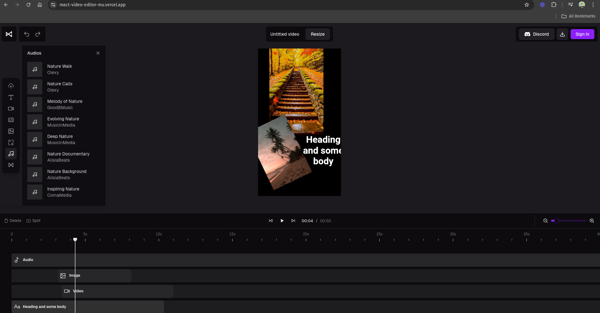

# Video editor in React JS

The project is for video editing through tools such as DesignCombo, ShaCDN, React, etc. In order to improve the quality of the user experience that comes with the use of these very heavy software, all this in a light and web-based way.


## Installation

Install react-video-editor with npm

```bash
<<<<<<< HEAD
  git clone https://github.com/Pablituuu/react-video-editor.git
=======
>>>>>>> ddcf54e (first commit after  branching)
  cd react-video-editor
  npm install
  npm run dev
```


## License

[MIT](https://choosealicense.com/licenses/mit/)

## Demo

https://react-video-editor-mu.vercel.app/
<<<<<<< HEAD
{width=50%}
=======
>>>>>>> ddcf54e (first commit after  branching)
